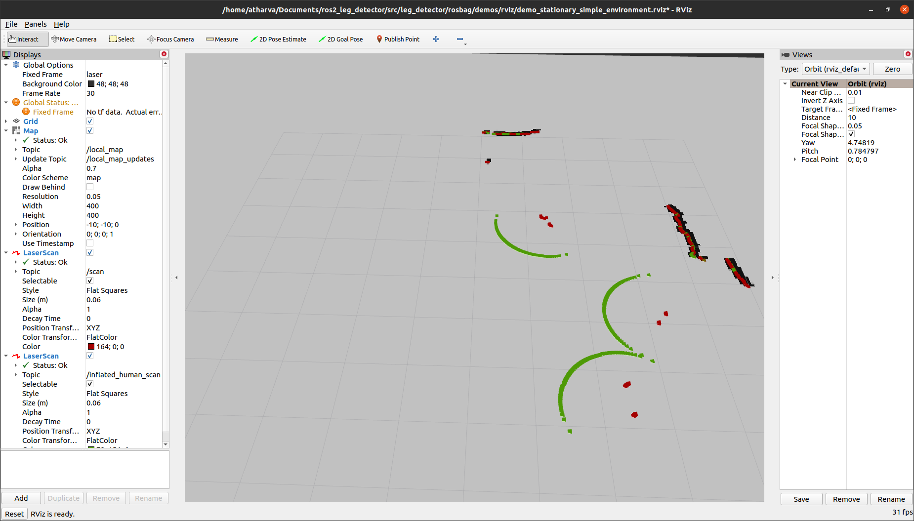
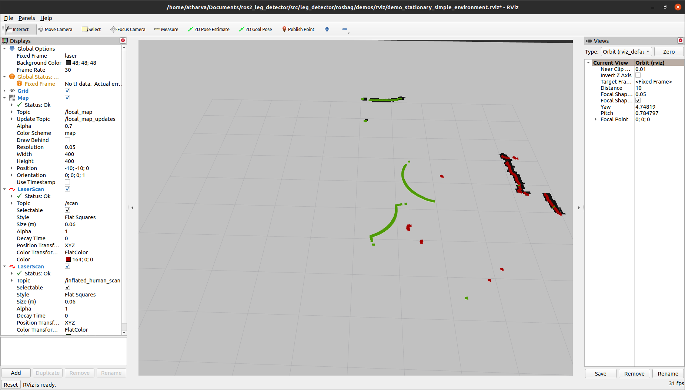

# ros2_leg_detector

This repository is developed for Mowito Obstacle Detection and Human Detection module in ROS2 Foxy Foxtrot.

To run Leg detector in ROS2 ensure you have OpenCV 3.4.12 installed

Here are the steps to Run leg_detector in ros2

1.  clone the repository 
2. build the code with the following command

    `$> colcon build`
3. source the newly buit package

    `$> source <path to ros2_leg_detector>/install/setup.bash`

4. run the code with the launch file using the following command

    `$> ros2 launch leg_detector demo_stationary_simple_environment.launch.py`

## Subsribed topics

* /scan

  2D Lidar scan points.

* /tf

  TF transforms between LiDAR and other frames.

All subscribed topics can be changed in the launch file

## Published topics

* /people_tracked
  
  Message of the type <code>PersonArray</code> containing the positions and velocities of the tracked people.

* /visualization_marker
  
  Markers for the tracked people, other tracked objects and the centroids of the detected clusters. 

## Important parameters

* scan_topic

  Laser scan topic

* scan_frequency

  Right now, it's only been tuned for 7.5, 10 or 15Hz laser scanners. If you're using something faster than this, I would recommend downsampling to one of these frequencies.

* fixed_frame

* publish_people_frame

## Other parameters

* max_detected_clusters

  If the program is running slow because there are a lot of objects to be tracked, you can set this so it only tracks the "max_detected_clusters" closest objects. Default: -1 (i.e., unlimited).

* forest_file

  where to find the configuration file for the OpenCV random forest which has been trained to determine the probability of a scan cluster being a human leg based on its shape.

* detection_threshold

  Confidence threshold in leg shape to publish detect clusters. We found be results publishing and tracking all clusters, regardless of confidence in leg shape. Default: -1 (i.e., no threshold).

* cluster_dist_euclid

  Euclidian distance for clustering of laser scan points. Any two laser scan points which are closer than this distance will be clustered together. If you change this, you might want to re-train the leg detector. Default: 0.13 (m).

* min_points_per_cluster

  Minimum scan points for a cluster to be valid. If a cluster has less than this, then we assume it's noise and delete it. Default: 3.

* max_detect_distance

  Maximum distance from laser scanner to consider detected clusters. Farther is better but decreases run speed. Default: 10.0 (m).

* max_leg_pairing_dist

  Maximum separation of legs. Legs further apart than this distance will not be matched. Default: 0.8 (m).

* confidence_threshold_to_maintain_track

  How high the confidence needs to be of the current track's leg shape to initiate and maintain a person track. Higher values will yield lower false positive people tracks and lower values higher false negatives. Will likely need re-tuning if you retrain the leg detector. Default: 0.1.

* publish_occluded

  If people who weren't seen in the previous scan should be published to the /people_tracked topic. Default: True.

* use_scan_header_stamp_for_tfs

  If you should use the scan headers to do tfs or just use the latest transform available. If you're trying to do repeatable tests on recorded bags than it might be useful to use the scan headers. Default: False (i.e., use latest tf available).

* display_detected_people

  Previously used only for debugging.  Default: False.

* dist_travelled_together_to_initiate_leg_pair

  How far a candidate leg pair must travel to initiate a person track. Default: 0.5 (m).

* in_free_space_threshold

  A threshold to determine whether a track should be considered in free space or occupied space. Default: 0.06.

* confidence_percentile

  Confidence percentile for matching of clusters to tracks. Larger confidence percentile generates larger gates for the tracks to match to new clusters. You should be able to view the size of the gates in Rviz as circular visualization markers. Default: 0.9.

* max_std

  Maximum standard deviation of covariance of a track before it is deleted: Default: 0.9.

### Compatible laser scanners

right now it's trained for laser scanners of 0.33 degree resolution. Different resolutions should still be runnable but would probably require retraining to get optimal performance.

## Screenshots

  
  

## Acknowledgement

This code is a port the work of A. Leigh on <a href="https://github.com/angusleigh/leg_tracker">leg_detector</a>, for ROS2 Foxy.

## References

A. Leigh, J. Pineau, N. Olmedo and H. Zhang, Person Tracking and Following with 2D Laser Scanners, International Conference on Robotics and Automation (ICRA), Seattle, Washington, USA, 2015. <a href="https://www.cs.mcgill.ca/~aleigh1/ICRA_2015.pdf">pdf</a>

